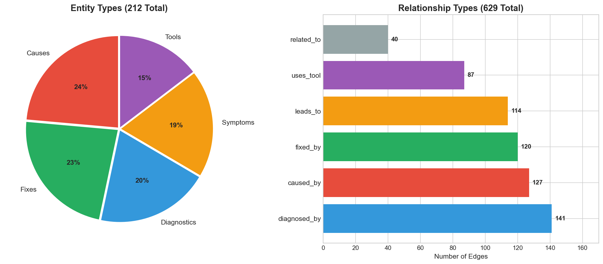
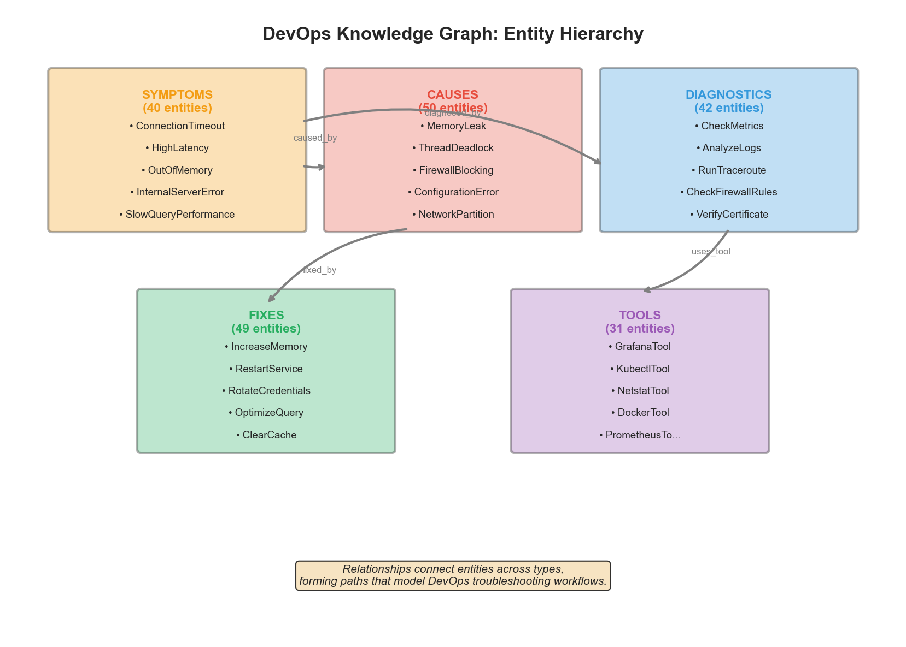
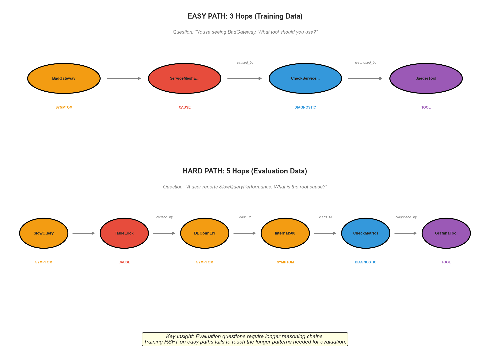
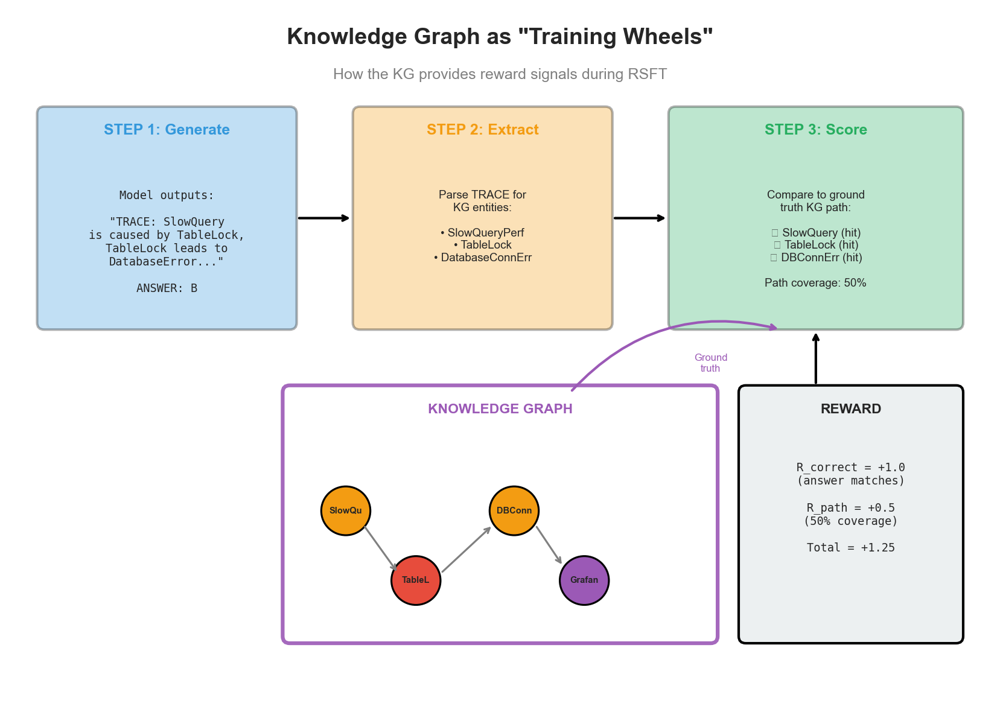
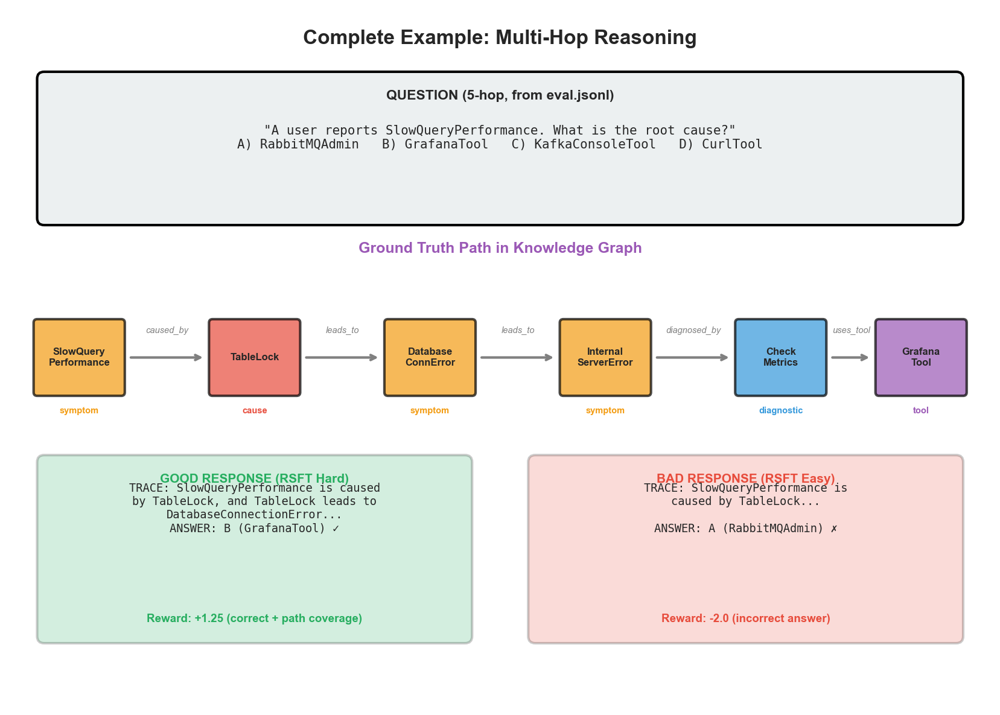

# The Knowledge Graph: Training Wheels for Multi-Hop Reasoning

*Understanding how structured domain knowledge guides model training*

This document explains the knowledge graph (KG) that serves as "training wheels" during Rejection Sampling Fine-Tuning (RSFT). The KG provides the ground truth paths that the model must learn to traverse, and supplies the reward signal that shapes its reasoning.

---

## What is the Knowledge Graph?

The knowledge graph encodes expert DevOps troubleshooting knowledge as a structured network of entities and relationships.



### By the Numbers

| Metric | Count |
|--------|-------|
| **Total Entities** | 212 |
| **Total Relationships** | 629 |
| **Entity Types** | 5 |
| **Relationship Types** | 6 |

### Entity Types

| Type | Count | Description | Examples |
|------|-------|-------------|----------|
| **Causes** | 50 | Root causes of problems | MemoryLeak, ThreadDeadlock, FirewallBlocking |
| **Fixes** | 49 | Solutions/remediations | IncreaseMemory, RestartService, ClearCache |
| **Diagnostics** | 42 | Investigation steps | CheckMetrics, AnalyzeLogs, RunTraceroute |
| **Symptoms** | 40 | Observable problems | ConnectionTimeout, HighLatency, OutOfMemory |
| **Tools** | 31 | Software tools | GrafanaTool, KubectlTool, NetstatTool |

### Relationship Types

| Relationship | Count | Meaning | Example |
|--------------|-------|---------|---------|
| `diagnosed_by` | 141 | Symptom → Diagnostic | HighLatency → RunTraceroute |
| `caused_by` | 127 | Symptom → Cause | OutOfMemory → MemoryLeak |
| `fixed_by` | 120 | Cause → Fix | MemoryLeak → IncreaseMemory |
| `leads_to` | 114 | Entity → Entity | TableLock → DatabaseConnectionError |
| `uses_tool` | 87 | Diagnostic → Tool | CheckMetrics → GrafanaTool |
| `related_to` | 40 | General association | Various |

---

## Entity Hierarchy



The entity types form a natural hierarchy reflecting real DevOps troubleshooting:

```
SYMPTOM (what you observe)
    ↓ caused_by
CAUSE (why it happens)
    ↓ fixed_by
FIX (how to solve it)

SYMPTOM (what you observe)
    ↓ diagnosed_by
DIAGNOSTIC (how to investigate)
    ↓ uses_tool
TOOL (what software to use)
```

### Domain Example: Database Slowdown

```
SlowQueryPerformance  (symptom)
        ↓ caused_by
    TableLock         (cause)
        ↓ leads_to
DatabaseConnectionError (symptom)
        ↓ diagnosed_by
    CheckMetrics      (diagnostic)
        ↓ uses_tool
    GrafanaTool       (tool)
```

This 5-hop path represents expert knowledge: "If you see slow queries, it might be caused by table locks, which can lead to connection errors. To diagnose, check your metrics using Grafana."

---

## Path Complexity: Easy vs Hard

The critical insight of this project is that **path length matters**.



### Easy Paths (1-3 Hops) — Training Data

```
Question: "You're seeing BadGateway. What tool should you use?"

Path: BadGateway → ServiceMeshError → CheckServiceMesh → JaegerTool
      (symptom)     (cause)           (diagnostic)       (tool)

Hops: 3
```

The model only needs to follow a short chain of reasoning:
1. BadGateway is caused by ServiceMeshError
2. ServiceMeshError is diagnosed by CheckServiceMesh
3. CheckServiceMesh uses JaegerTool

### Hard Paths (4-5 Hops) — Evaluation Data

```
Question: "A user reports SlowQueryPerformance. What is the root cause?"

Path: SlowQuery → TableLock → DBConnErr → Internal500 → CheckMetrics → GrafanaTool
      (symptom)   (cause)     (symptom)   (symptom)     (diagnostic)   (tool)

Hops: 5
```

The model must follow a longer, more complex chain:
1. SlowQueryPerformance is caused by TableLock
2. TableLock leads to DatabaseConnectionError
3. DatabaseConnectionError leads to InternalServerError
4. InternalServerError is diagnosed by CheckMetrics
5. CheckMetrics uses GrafanaTool

---

## Distribution Mismatch Problem


### The Training/Evaluation Gap

| Dataset | Hop Lengths | Purpose |
|---------|-------------|---------|
| `train.jsonl` | 1-3 hops | SFT format learning |
| `eval.jsonl` | 4-5 hops | Evaluate reasoning ability |

### Why This Matters for RSFT

When RSFT trains on **easy examples** (1-3 hops):
- The model learns to produce short reasoning traces
- It optimizes for simple cause→effect chains
- When evaluated on 5-hop questions, it fails to extend its reasoning

When RSFT trains on **hard examples** (4-5 hops):
- The model learns to produce longer reasoning traces
- It learns to chain multiple relationships together
- Evaluation accuracy jumps from 27% to **67%**

---

## How the KG Serves as "Training Wheels"



### The RSFT Process

**Step 1: Generate**
```
Model outputs:
TRACE: SlowQueryPerformance is caused by TableLock,
       and TableLock leads to DatabaseConnectionError...
ANSWER: B
```

**Step 2: Extract**
```
Parse TRACE for KG entities:
• SlowQueryPerformance (found!)
• TableLock (found!)
• DatabaseConnectionError (found!)
```

**Step 3: Score**
```
Compare to ground truth path:
Ground truth: [SlowQuery, TableLock, DBConnErr, Internal500, CheckMetrics, Grafana]
Model trace:  [SlowQuery, TableLock, DBConnErr]

Hits: 3 out of 6
Path coverage: 50%
```

**Step 4: Reward**
```
R_correct = +1.0  (answer B is correct)
R_path    = +0.5  (50% coverage)
Total     = +1.25

→ This response is selected for RSFT training
```

### Why "Training Wheels"?

The knowledge graph acts as training wheels because:

1. **Provides Ground Truth**: Without the KG, we'd have no way to verify if the model's reasoning is correct
2. **Automated Scoring**: The KG enables automatic reward computation at scale
3. **Teaches Structure**: The model learns that reasoning follows predictable patterns (cause→effect, symptom→diagnostic)
4. **Eventually Removed**: After training, the model reasons without KG access (like removing training wheels)

---

## Complete Example: Multi-Hop Question



### The Question

```
"A user reports SlowQueryPerformance. What is the root cause?"
A) RabbitMQAdmin   B) GrafanaTool   C) KafkaConsoleTool   D) CurlTool
```

### The Ground Truth Path (5 hops)

```
SlowQueryPerformance → TableLock → DatabaseConnectionError
    → InternalServerError → CheckMetrics → GrafanaTool
```

**Correct Answer: B (GrafanaTool)**

### Good Response (RSFT on Hard Examples)

```
TRACE: SlowQueryPerformance is caused by TableLock,
       and TableLock leads to DatabaseConnectionError,
       and DatabaseConnectionError leads to InternalServerError,
       and InternalServerError is diagnosed by CheckMetrics,
       and CheckMetrics uses tool GrafanaTool
ANSWER: B
```

**Reward: +1.25** (correct answer + good path coverage)

### Bad Response (RSFT on Easy Examples)

```
TRACE: SlowQueryPerformance is caused by TableLock...
ANSWER: A
```

**Reward: -2.0** (incorrect answer)

The model trained on easy examples:
- Stops reasoning too early
- Doesn't learn to chain 5 relationships
- Guesses incorrectly

---

## Key Takeaways

### 1. Structure Enables Learning

The KG provides structured domain knowledge that guides the model to learn correct reasoning patterns, not just memorize answers.

### 2. Distribution Matching is Critical

Training must match evaluation complexity:
- Train on 1-3 hop → Fails at 4-5 hop
- Train on 4-5 hop → Succeeds at 4-5 hop

### 3. Path Coverage Matters

The reward function doesn't just check the final answer—it also measures how well the model's reasoning trace aligns with the KG path. This teaches the model to show its work.

### 4. Scalable Supervision

The KG enables automatic supervision of reasoning quality at scale, without human annotation of each reasoning step.

---

## Technical Details

### Data Files

| File | Description |
|------|-------------|
| `data/kg.json` | Knowledge graph (entities + edges) |
| `data/train.jsonl` | Easy examples (1-3 hops) |
| `data/eval.jsonl` | Hard examples (4-5 hops) |

### Reward Formula

```
R_total = W_corr × R_correct + W_path × R_path - P_spam

Where:
- R_correct = +1.0 (correct) or -2.0 (incorrect)
- R_path = min(hits/path_length, 1.0) if hits ≥ 2, else 0
- P_spam = 0.5 if any entity repeated >2 times
- W_corr = 1.0, W_path = 1.0 (weights)
```

### Generating New Data

```bash
# Generate training and eval questions from the KG
make data

# Train with distribution-matched RSFT
make train-360m
```

---

## References

- [Knowledge Graph-Guided RAG Paper](https://arxiv.org/html/2601.15160v1)
- [Results Documentation](results.md)
- [Reward Specification](../spec/reward.md)
- [Data Schemas](../spec/schemas.md)
